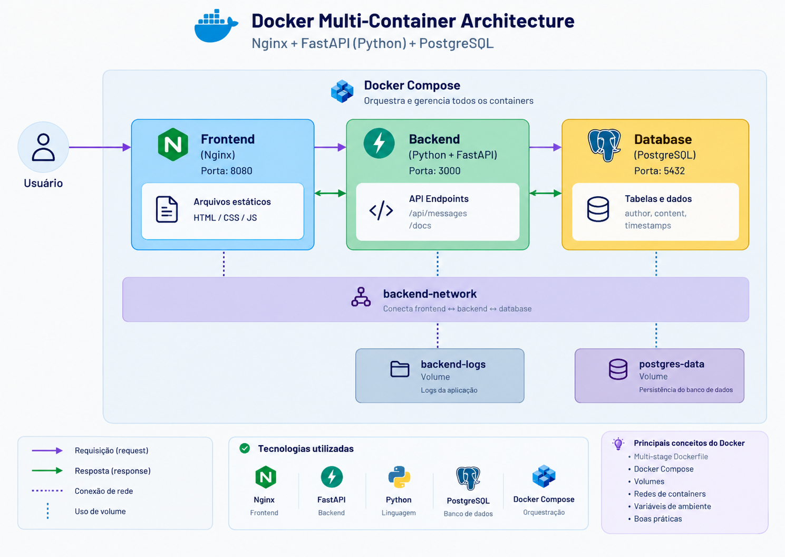

<div align="center">
  
  
  <h1>Projeto de aprendizado Docker</h1>
</div>


Este projeto demonstra boas práticas com Docker por meio de uma aplicação simples
composta por multi-container, utilizando Docker Compose.

A aplicação é formada por três containers:



1. **Frontend**: Um servidor web Nginx simples que disponibiliza arquivos HTML, CSS e JavaScript estáticos.

2. **Backend**: Um servidor de API desenvolvido com FastAPI.

3. **Banco de Dados**: Um banco de dados PostgreSQL utilizado para persistência dos dados.

> O foco deste projeto está nos conceitos do Docker, e não em uma lógica de aplicação complexa.

## Principais Conceitos de Docker Abordados

* Construção de imagens utilizando Dockerfile com múltiplos estágios (*multi-stage builds*)
* Docker Compose para orquestração de múltiplos containers
* Gerenciamento de volumes para persistência de dados
* Redes de comunicação entre containers
* Gerenciamento de variáveis de ambiente e secrets
* Boas práticas com Docker

## Estrutura do Projeto

```text
docker-multi-container/

├── docker-compose.yml      # Define e configura todos os serviços
├── .env                    # Variáveis de ambiente para o Docker Compose
├── README.md               # Documentação principal do projeto
├── frontend/               # Servidor web Nginx para arquivos estáticos
├── backend/                # Servidor de FastAPI 
└── database/               # Banco de dados PostgreSQL
```

## Como Começar

1. Clone este repositório.
2. Certifique-se de que o Docker e o Docker Compose estejam instalados.
3. Execute:

```bash
docker-compose up -d
```

4. Acesse a aplicação em:

```text
http://localhost:8080
```

## Funcionalidades da Aplicação

A aplicação é um simples mural de mensagens, no qual os usuários podem:

* Visualizar todas as mensagens
* Adicionar novas mensagens

Essa simplicidade permite que o foco esteja nos conceitos do Docker, em vez de em uma lógica de aplicação complexa.

## Conceitos de Docker Explicados

### Containers Docker

Containers são pacotes leves, independentes e executáveis que incluem tudo o que é necessário para executar uma aplicação.

Neste projeto, temos três containers que trabalham em conjunto, mas permanecem isolados uns dos outros.

### Imagens Docker

Imagens Docker são modelos somente leitura utilizados para criar containers.

Cada componente possui seu próprio Dockerfile, que define como sua respectiva imagem será construída.

### Volumes Docker

Os volumes são utilizados para garantir a persistência dos dados.

Neste projeto, utilizamos volumes para:

* **Dados do PostgreSQL**: garantem que as mensagens sejam preservadas mesmo que o container seja removido.
* **Logs do Backend**: preservam os dados de log após reinicializações dos containers.

### Redes Docker

Os containers se comunicam entre si por meio de redes Docker.

Neste projeto, utilizamos:

* **frontend-network**: conecta o frontend ao backend.
* **backend-network**: conecta o backend ao banco de dados.

### Variáveis de Ambiente

As variáveis de ambiente são utilizadas para configurar os containers sem precisar modificar o código da aplicação.

Neste projeto, utilizamos um arquivo `.env` e passamos essas variáveis por meio do Docker Compose.

### Docker Compose

Docker Compose é uma ferramenta utilizada para definir e executar aplicações Docker compostas por múltiplos containers.

O arquivo `docker-compose.yml` define os três serviços da aplicação e os relacionamentos entre eles.
